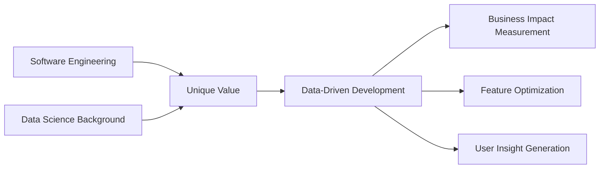

<div align="center">
  
  # Hey there! I'm Augusto Luzzi 👨‍💻✨
  
  
  
  [](https://www.linkedin.com/in/augusto-luzzi/)
  [](mailto:seu-email@example.com)
  
</div>

## 🎯 TL;DR

```javascript
const augusto = {
  role: "Software Engineer @ Grupo Marista",
  location: "Curitiba, PR 🇧🇷",
  experience: "2+ years",
  mindset: "Startup-oriented 🚀",
  superpower: "Connecting engineering with data insights 📊",
  currentlyLearning: "Cloud-native architectures",
  lookingFor: "Opportunities to combine full-stack dev with data innovation"
};
```

## 💫 About Me

> **"While most devs deliver code, I deliver intelligence."**

Started my journey in **Data Science at BRF**, where I discovered my superpower: connecting engineering and data analysis. Today, I build web and mobile applications that don't just work — they generate insights that impact thousands of users.

### 🏆 Highlights
- 🥇 **Winner** - HIPUC Health Innovation Hackathon
- 👔 **VP** - Software Engineering Academic Center (2 years)
- 🚀 **Active Member** - PUCPR-SPINE Entrepreneurship Hub
- 📊 **Data Background** - Transforming metrics into business decisions

## 🛠️ Tech Stack

<div align="center">

### Frontend


### Backend


### Data & Analytics


### Cloud & DevOps


</div>

## 📈 What Makes Me Different



## 🎓 Education & Achievements

- **B.S. Software Engineering** - PUCPR (2020-2023) | GPA: 10/10 🎯
- **Leadership** - VP of Academic Center, organizing tech events & workshops
- **Innovation** - Hackathon winner focusing on healthcare solutions
- **Community** - Active in entrepreneurship initiatives and tech talks

## 💼 Professional Journey

### Software Engineer @ Grupo Marista
*Sep 2023 - Present*
- Building scalable web and mobile applications impacting thousands of users
- Full-stack development with Java Spring Boot, Node.js, React.js
- Implementing CI/CD pipelines with Azure DevOps
- Creating data-driven dashboards and KPIs with Power BI

### Previous Experience
- **Software Engineering Intern** @ Grupo Marista (Sep 2022 - Sep 2023)
- **Data Science Intern** @ BRF (Aug 2021 - Feb 2022)

## 🌱 Currently Exploring

- 🏗️ Cloud-native architectures and microservices
- 🤖 AI/ML integration in web applications
- 📊 Advanced data visualization techniques
- 🚀 Startup methodologies and rapid prototyping

## 💭 Fun Facts

```python
def fun_facts():
    return {
        "coffee_per_day": "∞",
        "favorite_IDE": "VS Code with tons of extensions",
        "debugging_soundtrack": "Lo-fi hip hop",
        "side_projects": "Private repos with crazy experiments 🔬",
        "dream": "Build a unicorn startup that changes lives 🦄"
    }
```

## 📊 GitHub Stats

<div align="center">
  
</div>

## 🤝 Let's Connect!

I'm always excited to collaborate on innovative projects, discuss tech trends, or help solve that impossible bug! 

<div align="center">
  
  **Open to opportunities where I can combine full-stack development with my passion for data and innovation**
  
  📫 **Reach out:** [LinkedIn](https://www.linkedin.com/in/augusto-luzzi/) | [Email](mailto:seu-email@example.com)
  
  ---
  
  
  
</div>

<div align="center">
  
  <span>&nbsp;&nbsp;</span>
  
</div>
